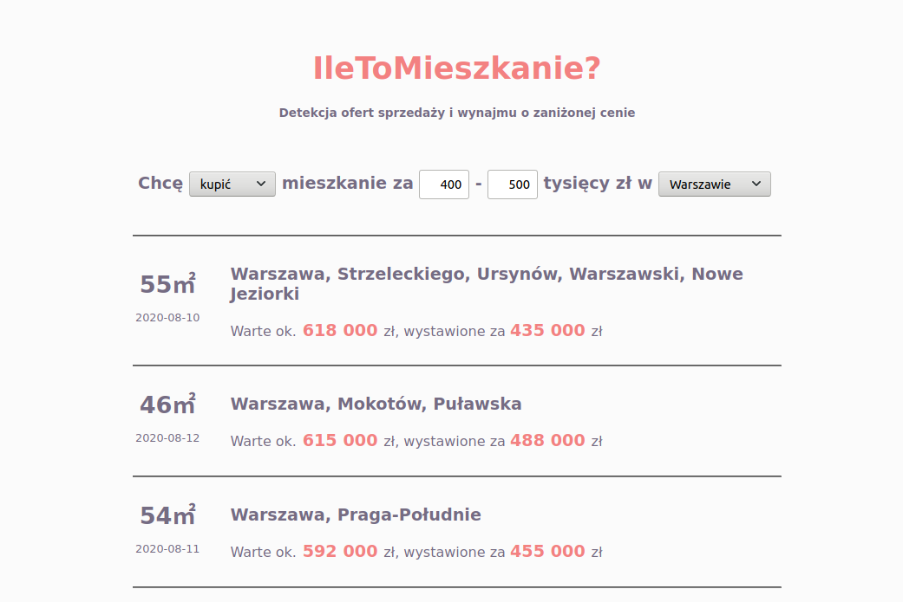

# [Flats](http://flats.antoniszczepanik.com)
Detect undervalued real estate offers by finding differences between valuation and offer prices.

Set of ETL and ML pipelines designed to valuate flat sale and rent offers.
Estimates are assigned to each scraped item and compared to actual prices,
which allows to instantly identify real estate opportunities.
The pipeline is run daily and results are presented on [queryable website](http://flats.antoniszczepanik.com).

=======
# [IleToMieszkanie](http://flats.antoniszczepanik.com)

1. Rent & sale offers are scraped and valuated.
2. Offer price is compared with valuations.
3. You can filter most interesing & preview most interesting ones on map.

[picture]

# How to run the project?

All components in this project are packaged as docker containers.
In order to run it you have to have `docker` and `docker-comspose` installed.

First run server and database containers, so to allow data to be stored.

`cd server && docker-compose up -d && cd ..`

After that you can scrape first offers. MinIO is used as local S3 storage so you have to set it up first:

`cd scraper && ./setup_minio.sh`

If you'd like to mount MinIO elsewhere than `~/flats_buckets` take a look at `./setup_minio.sh` script.
Then we can run container that scrapes and processes the data.

TODO: Generate coord map and 

`./run.sh scrape sale && ./run.sh process sale`

And you just scraped and valuated first batch of offers.

If you'd like to learn more about the script you can

`./run.sh --help`

# Technical description

The project is structured as 3 components.

- Scraper, which scrapes & valuates the offers. (model is applied as part of scraping pipeline)
- Server (REST + Postgres) allowing to query significant amount of data.
- Client, just to present the results in digestable form, on a map.

## Scraper
Scraper works as follows:
1. Scrape offers.
2. Clean data, filter outliers, generate new features, etc
3. Apply previously trained model.
4. Upload offers to the server.

Additionally one can run one of on demand tasks
- Model training, which will read raw scraped data after specified date.
- "Coords map" generation. This is a table of neigborhoods with mean prices & additional features assigned. 
  It will be stored in MinIO and used when applying the model.

## Webserver
Just a REST API with Postgres as a backend, written in FastAPI, Pyhon.

## Client
Vanilla Javascript + Leaflet
