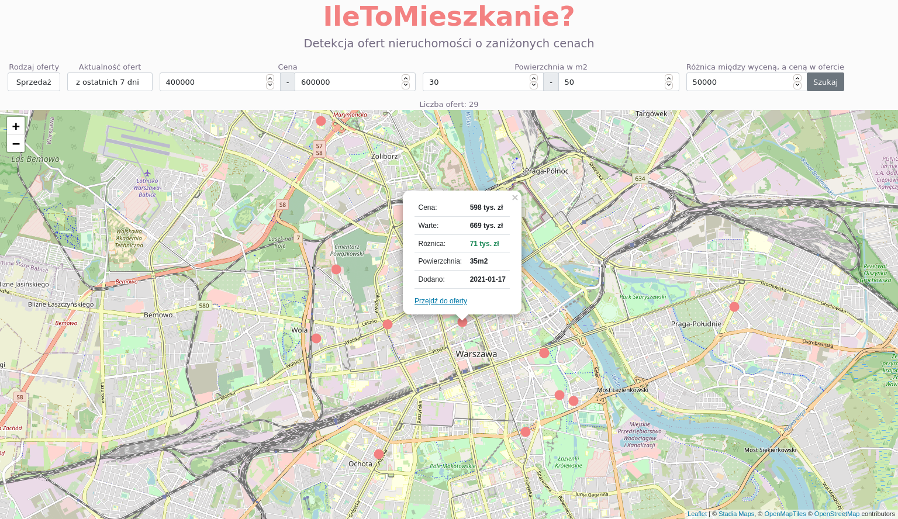
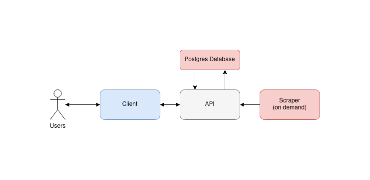
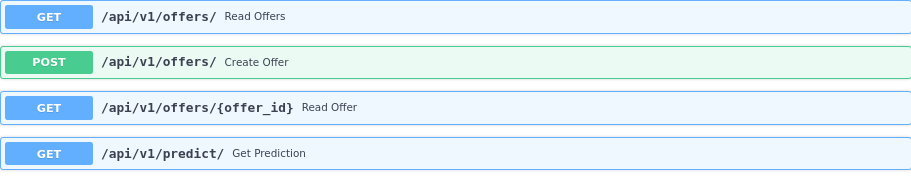

# Flats
The purpose of this project is to make process of searching for a new apartment in Poland more pleasent.

The general idea is as follows:

1. Rent & sale offers are scraped and valuated.
2. Offer price is compared with valuations.
3. You can filter & preview most interesting offers on map.

It could easily be extended to other countries by addding new scrapers.



# How to run it?

All components in this project are packaged as docker containers.
In order to run it you have to have `docker` and `docker-comspose` installed.

The first step is to run MinIO container - it serves as static data storage. It mimics S3, which would be used in production.

```txt
cd scraper && ./setup_minio.sh && cd ..
```

After that run server and database containers. This is where scraped data will be finally uploaded.

```txt
cd server && docker-compose up -d && cd ..
```
Now, you have to train the model. Scrape the data with:

Train the model:

Now you can scrape & process first offers.

```txt
./run.sh scrape sale && ./run.sh process sale
```

And you just scraped and valuated first batch of offers :) 

`./run.sh` is used to run all on-demand task in this project. To learn more try:

```txt
./run.sh --help
```

# Architecture Overview

The project is structured as 3 components.

- Scraper which scrapes & valuates the offers.
- Server which allows to query the data.
- Client, just to present the results on a map.

The interaction between the components is presented in the chart below.



## Scraper

Scraper works as follows:

1. It scrapes offers.
2. Data is cleaned, outliers are filtered, new features are added, etc
3. Newest of previously trained models is applied.
4. Offers are uploaded through API.

Additionally one can run one of on demand tasks:

- Model training, which will read all the data scraped and train a new model based on that. This could be done through Jupyter Notebook to allow supervision of trained model parameters.
- "Coords map" generation. This is a table of neigborhoods with mean prices & additional features assigned. It is generated based on whole data and it is used later when training & applying the model.

### Model
The model is Random Forest Regressor.
It's trained on all historically scraped data, so the offer price are predicted.
Currently the error is around 14% nRMSE for both sale and rent offers.

## Webserver

Webservers role is to allow querying all scraped & valuated offers.
It offers REST API (with Postgres in the backend) allowing to add and retrieve offers.
The endpoint available are presented below.



More complete Swagger documentation is availabe at `{server_url}{server_port}/docs`.


## Client

The client has been written in vanilla Javascript. Leaflet was used for mapping capabilities.
You can filter & preview most interesting ones on map. It is possible to query the data by following paramters:

- offer type (both rent & sale offers are supported)
- date when offer was added
- offer price
- size
- difference between valuation and offer price
