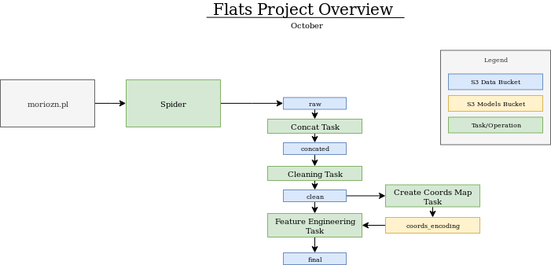

# Flats

  

  Prices/m2 on map of Warsaw.

### Currently the project consists of 2 elements:
- webcrawler which scrapes Polish flats rent and sale offers daily.
- data cleaning and feature engineering pipelines.

The goal of this project is producing possibly best real estate evaluation model and serving it as an API.

Webcrawler and all pipelines are deployed on an EC2 instance. Data is stored on S3 at each stage of the processing.

# Modelling 
As of October 2019 modelling is based on around 100k rent offers and 150k sale offers.
Metric used for evaluation is **RMSE/mean(price_m2)**. RMSE is normalized to allow comparrison between models trained on populations with different price levels (i.e. big city vs. rural areas)

Our baseline is std(y) which is equal to rmse when predictions are made with mean.

**Baseline RMSE (std(y)) = 3323**  
**Baseline RMSE/mean(y) = 0.305**

Out of all models tested (linear(also on onehotencoded bitmap), rf, xgboost) the best performance is achieved by RandomForests.

**Random Forest** {'n_estimators': 1200, 'min_samples_split': 2, 'min_samples_leaf': 1, 'max_depth': 150, 'bootstrap': True}

On validation set:

**RMSE = 1533**  
**RMSE/mean(y) = .141**

  

  

A future, long term goal is detection of undervalued properties and automating alerts when such are added to the scraped offer site. 
